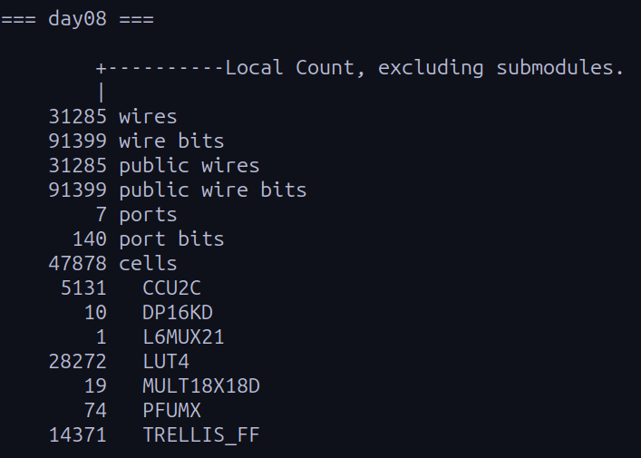

# Advent of FPGA

This repository contains my solutions for the **Advent of FPGA** challenges, implemented using **Hardcaml**.

## Directory Structure

The code for each day is self-contained in its own directory.

```text
/
├── dune-project
└── day*/
    ├── src/
    │   ├── day*.ml                   # Hardware logic (State machine & datapath)
    │   └── dune
    └── test/
    │   ├── input.txt                 # My puzzle input
    │   ├── day*_golden_solution.py   # Golden model (Python verification solution)
    │   ├── testbench                 # C++/HardCaml testbench
    │   ├── gen_verilog.ml            # Generate verilog for HardCaml design
    │   └── dune
    └── resource_use_day*.png         # Synthesized design's resource utilization

```

## How to Run

### Prerequisites

You need an OCaml environment with `dune` and `hardcaml`. The best way to run this is on **Linux** or **WSL** (if on Windows). You need `opam` installed for this.

**1. Install Dependencies**

```bash
opam init
opam switch create 5.2.0

# Install required libraries
opam install core hardcaml hardcaml_waveterm dune ppx_jane

```

**2. Run the Testbench**
I have included a `Makefile` to simplify running the simulations. Note that Day 8 requires **Verilator** installed to compile the C++ testbench.

```bash
make day1   # Runs the pure Hardcaml simulation (OCaml testbench)
make day8   # Generates Verilog -> Compiles C++ model -> Runs simulation (approx. 25M cycles)

```

**3. Synthesize the Design**
You can also synthesize the designs to check resource usage on a Lattice ECP5 FPGA (requires **Yosys**). Run these commands only **AFTER** the corresponding day's design has been simulated (the verilog file needs to be generated so that Yosys can synthesize it).

```bash
make day1_synth
make day8_synth # Synthesizes and prints the resource utilization report

```

---

## Day 1 Solution

Day 1's problem involved processing a series of pointer movements (e.g., `R51`, `L100`) to track the position on a 100-number dial and calculate the number of times the pointer landed at and passed `0`.

### Technical Approach

The design is implemented as a Finite State Machine (FSM) with three stages:

1. **Wait:** Identifies the direction (`L` or `R`) and resets the `mv` counter (counts steps to move in the input).
2. **ParseDig:** Reads ASCII digits one by one, converting string input into a 32-bit integer.
3. **Execute:** Performs the dial logic.

**Key Optimizations:**

* **Division Optimization:** Integer division is expensive in hardware. Instead of a divider, I implemented division by 100 using **reciprocal multiplication** (`x * 0x51EB851F >> 37`).
* **State Update:** Calculates the next position and checks wrap-around conditions in a single cycle.
* **Accumulation:** Updates the Part 1 and Part 2 answer registers based on the calculated next state.

---

## Day 8 Solution

Day 8 involved parsing a list of 3D coordinates, calculating the Euclidean distance between every pair of nodes, and connecting the closest points until all points formed a single component. The core challenge was sorting a massive number of edges and implementing a Union-Find data structure in hardware. Since the algorithm processes pairs in order of distance and the problem does not provide tie-breaking criteria, I assumed that all pairwise distances are unique.

Unlike Day 1, this solution uses a **hybrid verification flow** (`Hardcaml -> Verilog -> C++ Testbench`). Due to the high complexity (25M-30M simulation cycles), the standard OCaml interpreter was too slow, so I relied on a compiled Verilator model for verification.

### Technical Approach

This design comprises three main architectural blocks controlled by a central FSM:

1. **Systolic Priority Queue (Sorting):**
* To handle the massive sorting requirement for edge weights, I implemented a **systolic priority queue** with **200 processing elements (configurable)**.
* **Strategy:** The puzzle input contains 1,000 points, resulting in nearly 1 million edges. Storing and sorting all edges is impossible on-chip. Instead, I generate edges on the fly and insert them into the queue only if they are larger than a threshold (we only need to sort distances we haven't processed so far).
* **Implementation:** Each cell compares incoming weights against stored values, swapping and shifting data in real-time, storing the smallest values seen so far. This provides a sorted stream of the smallest edges without external memory.


2. **Hardware Union-Find:**
* I implemented a sequential Union-Find engine backed by **Block RAM (BRAM)** using `Hardcaml.Ram`. Parallelizing Union-Find is difficult due to data dependencies.
* The BRAM stores parent pointers and component sizes. The FSM implements **path compression** during `find` operations to optimize future lookups, keeping the runtime manageable.


3. **Coordinate Storage:**
* Input coordinates are cached in BRAM to save flip-flops for the complex FSM.
* The engine re-calculates pairwise distances on demand during the **Generate** state, trading computational cycles for significant memory savings.

---

## Resource Utilizations
### Day 1


### Day 8

