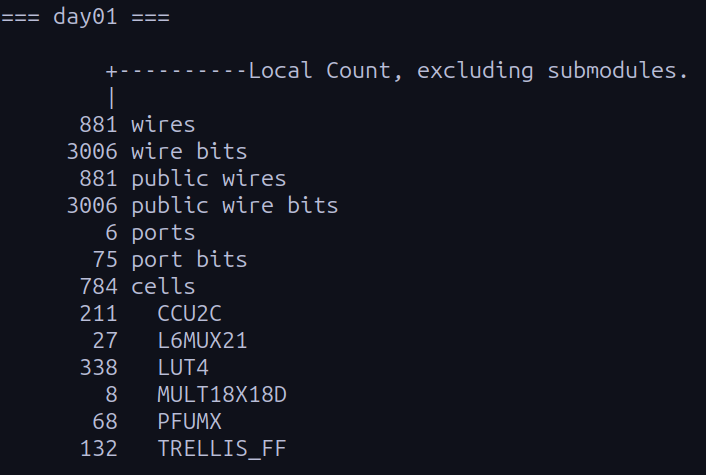

# Advent of FPGA
## Day 1 Solution

Day 1's problem involved processing a series of pointer movements (e.g., `R51`, `L100`) to track the position on a 100-number dial and calculate the number of times the pointer landed at and passed `0`.

### Directory Structure

The code for day 1 is self-contained in the `day1` directory.

```text
submission/
├── dune-project
└── day1/
    ├── src/
    │   ├── day1.ml                   # Hardware logic (State machine & datapath)
    │   └── dune
    └── test/
        ├── input.txt                 # My puzzle input
        ├── day1_golden_solution.py   # Golden model (Python verification solution)
        ├── test_day1.ml              # OCaml Testbench & Verilog generator
        └── dune

```

### Technical Approach

The design is implemented as a Finite State Machine (FSM) with three stages:

1. **Wait:** Identifies the direction (`L` or `R`) and resets the `mv` counter (counts steps to move in the input).
2. **ParseDig:** Reads ASCII digits one by one, converting string input into a 32-bit integer.
3. **Execute:** Performs the dial logic.

* **Division Optimization:** Integer division is expensive in hardware. Instead of a divider, I implemented division by 100 using **reciprocal multiplication** (`x * 0x51EB851F >> 37`).
* **State Update:** Calculates the next position and checks wrap-around conditions in a single cycle.
* **Accumulation:** Updates the Part 1 and Part 2 answer registers based on the calculated next state.

### How to Run
#### Prerequisites

You need an OCaml environment with `dune` and `hardcaml`. The best way to run this is on **Linux** or **WSL (if on Windows)**. You need `opam` installed for this.

**1. Install Dependencies**

```bash
opam init
opam switch create 5.2.0

# Install required libraries
opam install core hardcaml hardcaml_waveterm dune ppx_jane
```

**2. Run the Testbench**
This command runs the simulation, verifies the hardware against the Python "Golden Model", and generates the Verilog output.

```bash
dune runtest
```

* **Success:** You will see `Part 1: MATCH` and `Part 2: MATCH`.
* **Artifacts:** The Verilog file `day01.v` is generated in the build folder.

### Synthesis & Resource Utilization

To verify that the design is synthesizable and efficient, I synthesized it for the Lattice ECP5 FPGA using **Yosys**.

**Command:**

```bash
yosys -p "synth_ecp5 -top day01; stat" _build/default/day1/test/day01.v
```


